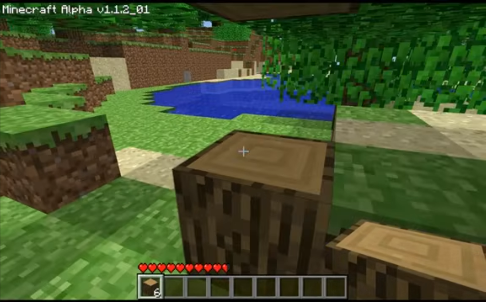

FidelityFX Super Resolution 1.0 for Chrome (DLL Injection)

This project enables AMD FidelityFX Super Resolution 1.0 (FSR) upscaling and sharpening for Chrome / Chromium-based web browsers via DLL injection.

Features

FSR 1.0 upscaling + RCAS sharpening

Works on video playback in Chrome

Toggle on/off at runtime

Visual injection confirmation

Controls

Toggle FSR: F10

Requirements / Limitations

Hardware acceleration must be enabled

Software rendering is not supported

Installation

Copy the following shader files:

rcas.hlsl

fsr1.hlsl

ffx_a.h

ffx_fsr1.h

into:

C:\Program Files\Google\Chrome\Application\%VERSION%

Example:

C:\Program Files\Google\Chrome\Application\144.0.7559.133

Optional (automatic loading, no injector required):

If a dxil.dll already exists in the Chrome folder, replace it with the provided DLL

The replacement DLL must also be named dxil.dll

This allows the mod to load automatically when Chrome starts.

Manual Injection

If you do not replace dxil.dll:

Inject the DLL into the Chrome process with the window title:

Chrome_WidgetWin_0

If the injection is successful, a green 20×20 pixel box will appear on every video as a visual indicator.

Video Demonstration

https://youtu.be/XUDsCbMS07Y

FSR 1.0 Shader Source

Official AMD FidelityFX FSR 1.0 shaders:
https://github.com/GPUOpen-Effects/FidelityFX-FSR/tree/master/ffx-fsr

## Comparison

### Without FSR

### With FSR

